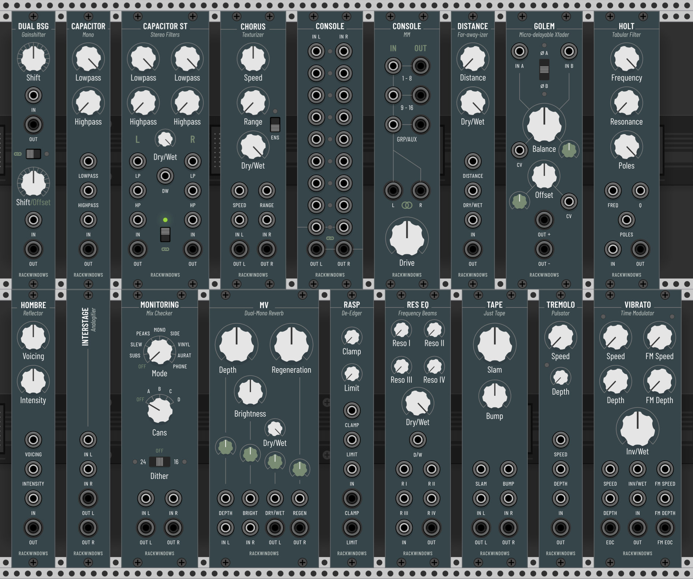
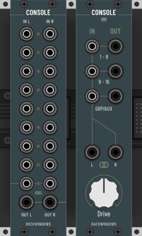

# A collection of VCV Rack modules based on audio plugins by Chris Johnson from Airwindows

Most of these modules are straight-up ports of [Airwindows](http://www.airwindows.com) plugins with the addition of a panel (designed to be potentially buildable in hardware) and the occasional tweak or enhancement to take advantage of the modular environment.

Airwindows plugins are known for exceptional sound quality, innovative approaches and minimalist interfaces. They often focus on and excel at one specific task, which is why I think they are a natural fit for Rack.

For more in-depth information about the inner workings of a particular Airwindows plugin please check Chris' [website](http://www.airwindows.com). There is a video on every plugin along with a description and I encourage everyone to explore his body of work. Chances are you stumble upon other gems here and there. He's got a [Patreon](https://www.patreon.com/airwindows) in case you appreciate and want to support what he does.

## Licence

See [LICENSE.md](LICENSE.md) for all licenses

## Modules

- [Capacitor Mono/Stereo](#capacitor): Filters
- [Chorus](#chorus): Chorus with multi-tap option (Ensemble)
- [Console](#console): Stereo summing mixer
- [Distance](#distance): Designed to mimic through-air high frequency attenuation
- [Dual BSG](#dual-bsg): Dual gain shifter
- [Hombre](#hombre): Texas tone and texture
- [MV](#mv): Dual-mono reverb
- [Tape](#tape): All-purpose tape mojo
- [Tremolo](#tremolo): Organic pulsating thing
- [Vibrato](#vibrato): FM Vibrator o_O

## Capacitor 

Filters

Comes in both mono and stereo, with the stereo version featuring an additional dry/wet control.

[More information](http://www.airwindows.com/capacitor)

## Chorus 

Chorus with multi-tap option (Ensemble) 

This surprisingly versatile module is a combination of Airwindows Chorus and ChorusEnsemble. The switch lets you toggle between the two flavours.

[More information](http://www.airwindows.com/chorus-vst)

## Console 

NOTE: Due to how the encoding/decoding works, spaciousness and definition will increase with each additional channel. There will be no effect on a single channel at all.

Console sums signals in such a way where the resulting soundstage appears less flat, more spacious and more in line of what we know from analog mixing consoles. There are a number of variations/flavours of the Airwindows console concept and this module currently implements the most recent one, Console6. However I'm planning to make others selectable as well. Please check the link below for further information on how exactly this effect is achieved.

[More information](http://www.airwindows.com/console2)

## Distance 

Designed to mimic through-air high frequency attenuation

Pushes things back. Also quite nice on reverb returns.

[More information](http://www.airwindows.com/distance-vst)

## Dual BSG 

Dual gain shifter

Scales a signal up or down by increments of exactly 6 dB. If no input is connected, the respective output will provide constant voltage selectable in 1V steps from -8V to +8V. The lower section can be linked to the upper one to automatically compensate for values set by the upper 'Shift' knob. If linked the lower 'Shift' knob can be used to offset the signal in 6db steps (input connected) or 1V steps (input not connected). 

[More information](http://www.airwindows.com/bitshiftgain)

## Hombre 

Texas tone and texture

[More information](http://www.airwindows.com/hombre-vst)

## MV 

Dual-mono reverb

A reverb based on Bitshiftgain and old Alesis Midiverbs. Capable of turning everything into a pad or sustaining a 'bloom' forever. Watch your volume when using small amounts of depth with full on regeneration.

[More information](http://www.airwindows.com/mv)

## Tape 

All-purpose tape mojo

Tape is Airwindows' attempt to capture the very essence of what running audio through tape machines does to the signal. Driving it not only alters the volume, but also applies certain characteristics which are often associated with tape. The bump control allows to adjust the low end, e.g. in order to reign in excessive bass.

[More information](http://www.airwindows.com/tape)

## Tremolo 

Organic pulsating thing

Instead of volume animation Tremolo uses fluctuating saturation and antisaturation curves to create a more organic, somewhat tubey tremolo effect.

[More information](http://www.airwindows.com/tremolo-vst)

## Vibrato 

FM Vibrator o_O

Make sure to also play with the 'Inverse/Wet' knob for chorusing and flange effects. Two trigger outputs have been added for fun.

[More information](http://www.airwindows.com/vibrato-vst)

## Building from Source

To compile the modules from source, see the official [VCV Rack documentation](https://vcvrack.com/manual/Building.html).

## Colophon

The typeface used is [Barlow](https://github.com/jpt/barlow) by Jeremy Tribby